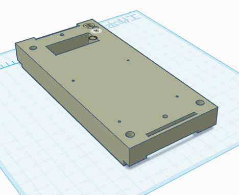
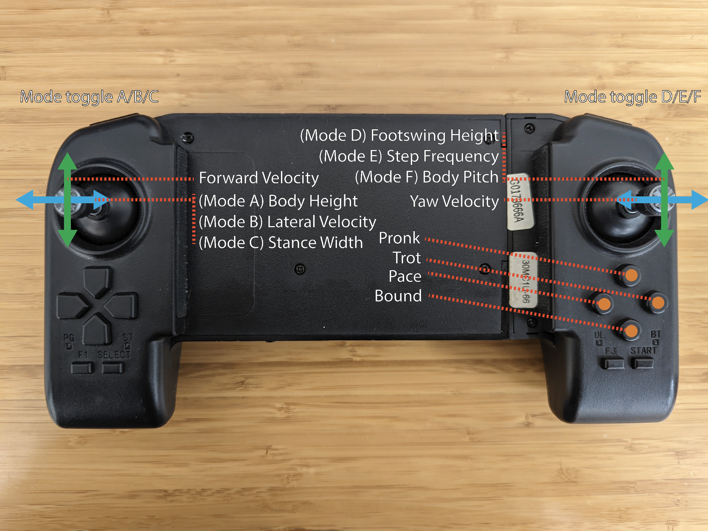

# Sim-to-Real project on Unitree Go2

## Overview

This warehouse is based on [walk-these-ways-go2](https://github.com/Teddy-Liao/walk-these-ways-go2) and has been adapted to RDK X5. Currently, we mainly introduce the deployment part

---
## Material
|name   | notes   |
|------|--------|
|Unitree Go2|null      |
|RDK X5|null      |
|Voltage reduction module|12-80V to 5V5A |
|USB connector|      |
|XT30U-M|     |
|bracket| The stl file can be found in the bracket folder|
---
## Deploy
The quantified bin model and onnx model have been provided, which can be run directly

### Requirements
#### LCM

```bash
git clone https://github.com/lcm-proj/lcm.git
mkdir build
cd build
cmake ..
make
sudo make install
```

#### Unitree_SDK2

```bash
cd go2_gym_deploy/unitree_sdk2_bin/library/unitree_sdk2
#Delete build file
rm -r build
#Install and build
sudo ./install.sh
mkdir build
cd build
cmake ..
make
```

### lcm_position_go2

Build lcm_position_go2 and generate runfile`lcm_position_go2`
```bash
cd go2_gym_deploy
rm -r build
mkdir build
cd build
cmake ..
make
```

### libmodel_task.so
```bash
git clone https://github.com/wunuo1/model_task.git -b x5
mkdir build
cd build
cmake ..
make -j4
#Place the libmodel_task.so under RDK-walk-these-ways-go2/go2/gym_deploy/scripts
cp libmodel_task.so RDK-walk-these-ways-go2/go2_gym_deploy/scripts
```


### Verify connection
RDK X5 connect Go2，test whether the network connection is normal
```bash
ping 192.168.123.161
```

Check the network card settings.I am eth0 here, used to start the `lcm_position_go2` function later
```bash
ifconfig
```

### Start LCM
```bash
cd go2_gym_deploy/build
sudo ./lcm_position_go2 eth0
```
Replace `eth0` with your own network interface address, press `Enter` for several times and the communication between LCM and unitree_sdk2 will set up


### Load and run policy
Open a new terminate and run
```bash
cd go2_gym_deploy/scripts
python deploy_policy_x5.py
#Provide onnx running scripts, if interested, you can use  eploy_policy_x5_onnx.py
```
According to the hints shown in terminal, Press button [R2] to start the controller

### Joystick Mapping



**Caution**:
* Press [L2+B] to switch to damping mode if any unexpected situation occurs!!!
* This is research code; use at your own risk; we do not take responsibility for any damage.

Test Video：https://www.bilibili.com/video/BV1sW9gY1EJF/
